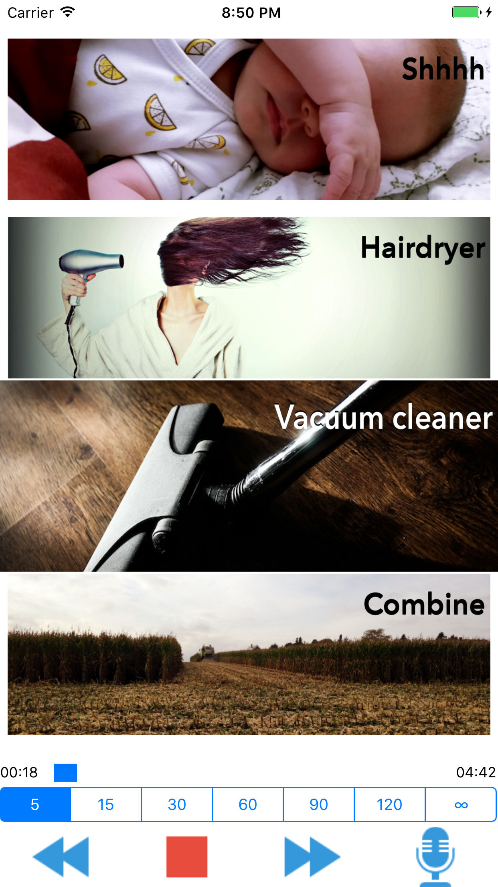
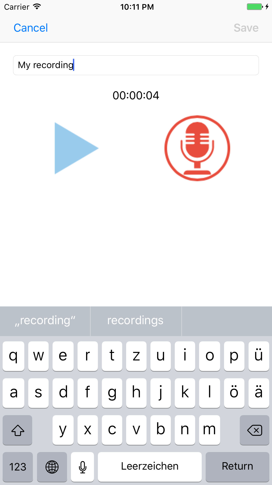

# SleepBabySleep

iOS & Swift side/learning project
Playos sounds for a given duration until the baby sleeps. Can also record sounds for repeated playback.

Listed in the [apple app store](https://itunes.apple.com/us/app/baby-shhh...-play-record-sleep/id1155116600?ls=1&mt=8).

** Backlog **
- [ ] Store recordings in iCloud Account 
- [ ] In recording dialog image with higher resolution
- [ ] Bottom controls stackView spacing

** Done **
- [X] Stop playback when a file should be deleted
- [X] German Translation (static sounds)
- [X] Delete confirmation popup - red delete button
- [X] Display remaning time and progess bar for running playback
- [X] Bug: When a new track is recorded it's selected in the collectionView, bit not in the playList. When play is clicked it plays the first track in the playlist
- [X] Assign recorded file images in plist file
- [X] Add / replace static sounds
- [X] Assign static sound images in plist file
- [X] Better highlighting of currently selected track
- [X] Selected tracks by previous & next controls when not playing 
- [X] iPhone plus / iPad UiCollectionView Problem 
- [X] Delete Recording swipe animation 
- [X] After recording select latest recording in playlist collectionView
- [X] Restore scrollState when app reopens (currently selects the lastSelected - in case played track was changed with mediaControls)
- [X] When user hits cancel or save in recording view - stop playback if running
- [X] Replace soundFileName label with a description in the textField
- [X] iOS 10 / Swift 3 Migration
- [X] Crash when quickly hitting the record button - probaply caused by unlocked / unsafe updateLoop
- [X] Handle AVAudioInterruptions while recording
- [X] Recording dialog
	- [X] Open dialog and add recording button with the same behaviour than currently in the main view. Push and hold to record. 
	- [X] Record into temporary file 
	- [X] Add navigationController (hidden in the main view) 
	- [X] Delete temporary recording when user hits back 
	- [X] When user selects add, move file to the documents directory and store the assignment with the name in the plist file. 
	- [X] Show recording duration 
	- [X] Change recording button while it is recording 
	- [X] Add preview, to listen to the recorded audio before user hits add 
- [X] Change AVAudioSession for recording
	- [X] AVAudioSessionCategoryPlayback 
	 -[X] AVAudioSessionCategoryPlayAndRecord 
	- [X] Options: ?AllowBluetooth, MixInWithOthers - https://developer.apple.com/library/ios/documentation/Audio/Conceptual/AudioSessionProgrammingGuide/AudioSessionBasics/AudioSessionBasics.html
- [X] Delete: RecordedSoundFileDirectory? 
